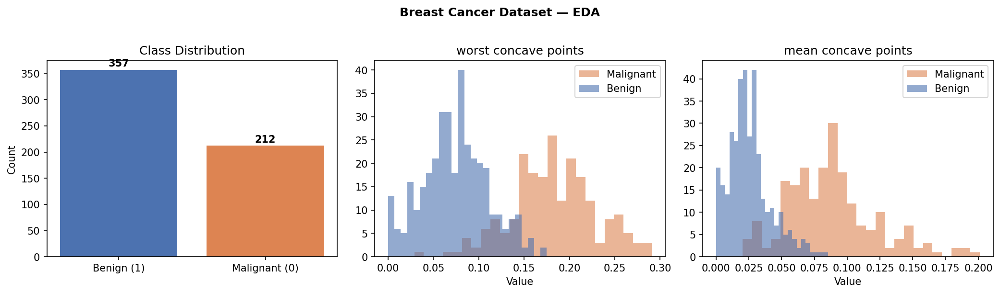
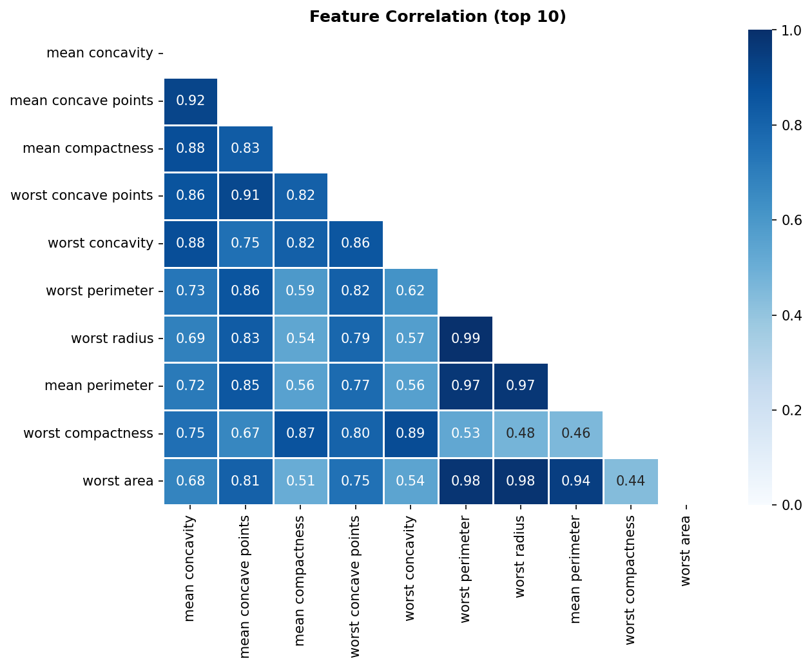
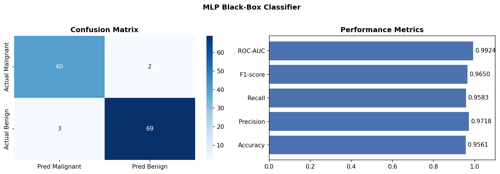
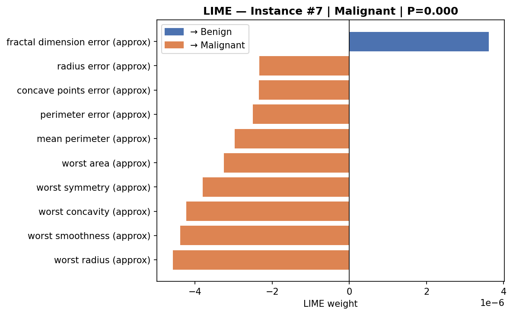
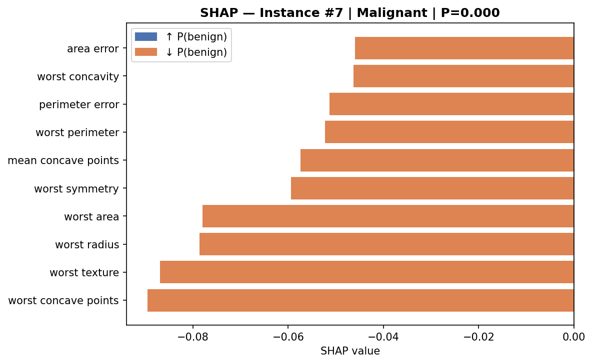
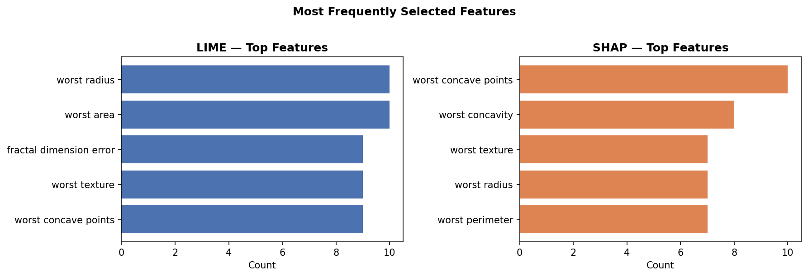
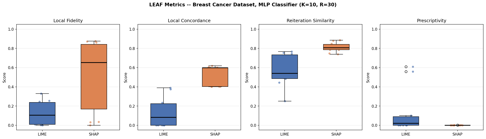
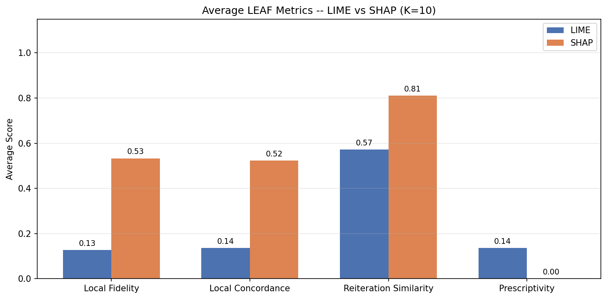
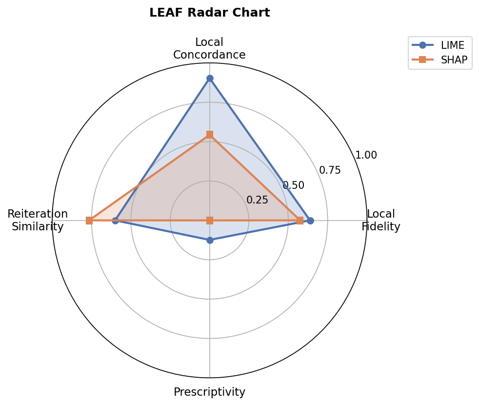
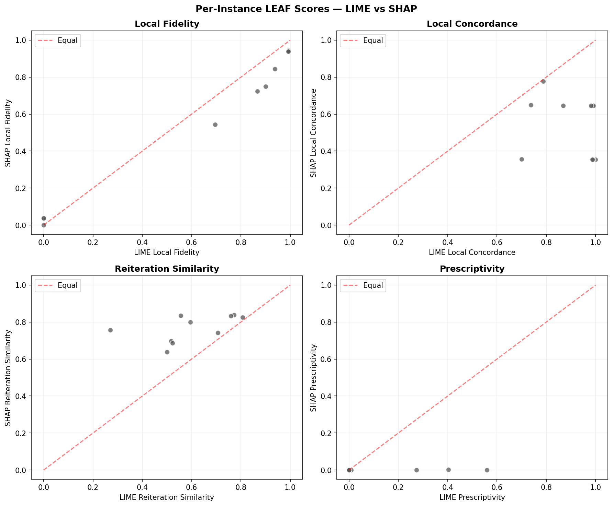

# LEAF: Evaluating Local Explanations of Black-Box Models

> *To reproduce all results, open our [Google Colab notebook](https://colab.research.google.com/drive/13Uq612IHjV0J57PJ1CSVC5oBrzy8w2JJ?usp=sharing).*

---

## Table of Contents

1. [Introduction](#introduction)
2. [Application Domain: Medical Diagnosis](#application-domain)
3. [Dataset: Wisconsin Breast Cancer](#dataset)
4. [The Black-Box Model: Multi-Layer Perceptron](#the-black-box-model)
5. [XAI Methods Overview](#xai-methods-overview)
6. [LIME — Step by Step](#lime)
7. [SHAP — Step by Step](#shap)
8. [The Evaluation Problem](#the-evaluation-problem)
9. [LEAF Framework](#leaf-framework)
   - [Metric 1: Conciseness](#metric-1-conciseness)
   - [Metric 2: Local Fidelity](#metric-2-local-fidelity)
   - [Metric 3: Local Concordance](#metric-3-local-concordance)
   - [Metric 4: Reiteration Similarity](#metric-4-reiteration-similarity)
   - [Metric 5: Prescriptivity](#metric-5-prescriptivity)
10. [Implementation: Putting It All Together](#implementation)
11. [Results & Analysis](#results)
12. [Key Findings](#key-findings)
13. [Lessons Learned](#lessons-learned)
14. [Conclusion](#conclusion)
15. [References](#references)

---

## Introduction

Imagine a doctor using an AI system to help diagnose breast cancer. The system says: *"This tumour is malignant — confidence 94%."* At that point, the doctor still needs to understand *why*. Not to replace clinical judgement, but to trust the output, explain it to the patient, and catch possible mistakes.

This is the main problem of **Explainable Artificial Intelligence (XAI)**: making decisions of complex ML models understandable for people.

A popular family of XAI methods called **Local Linear Explainers (LLE)** solves this by fitting a simple, interpretable model around each individual prediction. The two most widely used are **LIME** and **SHAP**. Both are very popular — but which one actually produces *better* explanations? And how do we even measure "better"?

In this tutorial, we implement and apply **LEAF** — the *Local Explanation evAluation Framework* introduced by Amparore et al. (2021) — to objectively compare LIME and SHAP across five principled quality dimensions. We apply it to a real medical classification problem: **breast cancer diagnosis**.

After reading this tutorial, you should understand:
- How LIME and SHAP generate local linear explanations
- Why we need a framework to evaluate explanations
- How to implement each of the 5 LEAF metrics from scratch
- What LIME and SHAP each do well — and where they fall short

---

## Application Domain

**Medical diagnosis** is one of the highest-stakes domains for AI. A misdiagnosis can mean delayed treatment or unnecessary surgery. When an AI model assists in diagnosis, two things are critical:

1. **Accuracy** — the model must be right most of the time
2. **Transparency** — clinicians must understand what drives each prediction

The second requirement is where XAI comes in. A 97% accurate black-box model is dangerous in medicine if doctors cannot verify *why* it says what it says. An explanation tells the doctor: *"The model flagged this tumour as malignant primarily because the cell nucleus radius and concave point count are unusually high."* That is actionable, auditable information.

Our project focuses on exactly this scenario: explaining a neural network's predictions on breast cancer biopsies.

---

## Dataset

We use the **Wisconsin Breast Cancer Diagnostic** dataset, originally published by Wolberg & Mangasarian (1990) and widely used as a benchmark in medical AI research.

| Property | Value |
|---|---|
| Source | UCI Machine Learning Repository |
| Samples | 569 |
| Features | 30 (real-valued) |
| Classes | **Malignant** (212) · **Benign** (357) |
| Train / Validation / Test split | 398 / 57 / 114 |

Each sample represents a digitised image of a **Fine Needle Aspirate (FNA)** — a tissue biopsy — of a breast mass. The 30 features describe geometric and textural properties of the cell nuclei visible in the image. Specifically, for each of 10 nuclear measurements (radius, texture, perimeter, area, smoothness, compactness, concavity, concave points, symmetry, fractal dimension), three statistics are computed: **mean**, **standard error**, and **worst** (largest value in the image).

### Data Preprocessing

```python
from sklearn.datasets import load_breast_cancer
from sklearn.model_selection import train_test_split
from sklearn.preprocessing import StandardScaler
import numpy as np

# Load dataset
data = load_breast_cancer()
X, y = data.data, data.target          # X: (569, 30), y: 0=malignant, 1=benign

# 70% train, 10% validation, 20% test
X_train_val, X_test, y_train_val, y_test = train_test_split(
    X, y, test_size=0.2, random_state=42, stratify=y
)
X_train, X_val, y_train, y_val = train_test_split(
    X_train_val, y_train_val, test_size=0.125, random_state=42, stratify=y_train_val
)

# Standardise: zero mean, unit variance (important for neural networks)
scaler = StandardScaler().fit(X_train)
X_train = scaler.transform(X_train)
X_val   = scaler.transform(X_val)
X_test  = scaler.transform(X_test)
```

`load_breast_cancer()` : Loads the dataset directly from scikit-learn's built-in datasets.  
`train_test_split(..., stratify=y)` : Ensures each split has the same class ratio as the original dataset, avoiding imbalanced evaluation sets.  
`StandardScaler().fit(X_train)` : Fits the scaler only on the training data to prevent data leakage — the test set statistics must never influence normalisation.

### Exploratory Data Analysis

The violin plots below show the distribution of the first 10 features, grouped by diagnosis class (malignant = orange, benign = blue):



*Key observation: Features like `mean concave points`, `mean concavity`, and `mean perimeter` show strong separation between classes. Others like `mean fractal dimension` overlap heavily — meaning they contribute little to discrimination.*

The correlation matrix reveals the feature interdependencies:



*Strong positive correlations exist within feature groups: all "worst" measurements correlate with each other, as do "mean" measurements. This makes sense — a cell that is large on average is also likely large in its worst case.*

---

## The Black-Box Model

To simulate a realistic black-box scenario, we train a **Multi-Layer Perceptron (MLP)** using PyTorch. LIME and SHAP will only have access to the model's `predict_proba` output — they cannot inspect the weights or architecture.

### Architecture

```
Input Layer:   30 features (standardised)
               ↓
Hidden Layer 1: 100 units  + ReLU activation
               ↓
Hidden Layer 2:  50 units  + ReLU activation
               ↓
Output Layer:    1 unit    + Sigmoid → P(benign)
```

### Implementation

**Step 1: Define the architecture**

```python
import torch
import torch.nn as nn

class MLP(nn.Module):
    def __init__(self, input_dim):
        super().__init__()
        self.net = nn.Sequential(
            nn.Linear(input_dim, 100),   # 30 → 100
            nn.ReLU(),
            nn.Linear(100, 50),          # 100 → 50
            nn.ReLU(),
            nn.Linear(50, 1),            # 50 → 1 logit
        )

    def forward(self, x):
        return self.net(x)
```

`nn.Sequential` : Chains layers so that `forward(x)` passes data through them in order.  
`nn.Linear(in, out)` : Fully connected (dense) layer: `y = Wx + b`.  
`nn.ReLU()` : Rectified Linear Unit activation: `f(x) = max(0, x)`. Introduces non-linearity.  
The final `Linear(50, 1)` outputs a raw **logit** — we apply `torch.sigmoid` during training to convert it to a probability.

**Step 2: Training loop**

```python
from torch.utils.data import TensorDataset, DataLoader

device = "cuda" if torch.cuda.is_available() else "cpu"
model  = MLP(input_dim=30).to(device)

optimizer = torch.optim.Adam(model.parameters(), lr=1e-3)
criterion = nn.BCEWithLogitsLoss()   # binary cross-entropy + sigmoid in one step

# Wrap data in PyTorch tensors
X_tr = torch.tensor(X_train, dtype=torch.float32).to(device)
y_tr = torch.tensor(y_train, dtype=torch.float32).unsqueeze(1).to(device)
loader = DataLoader(TensorDataset(X_tr, y_tr), batch_size=32, shuffle=True)

for epoch in range(100):
    model.train()
    for xb, yb in loader:
        optimizer.zero_grad()         # clear gradients from previous step
        loss = criterion(model(xb), yb)
        loss.backward()               # compute gradients via backpropagation
        optimizer.step()              # update weights
```

`BCEWithLogitsLoss` : Numerically stable combined sigmoid + binary cross-entropy loss.  
`loss.backward()` : PyTorch's autograd computes ∂loss/∂weights for every parameter.  
`optimizer.step()` : Applies the Adam update rule: `θ ← θ − α · m̂/√v̂`.

**Step 3: Scikit-learn compatible wrapper**

LIME and SHAP expect a function with a `predict_proba(X)` method (scikit-learn API). We wrap our PyTorch model:

```python
class MLPWrapper:
    """Exposes sklearn-compatible predict_proba for LIME / SHAP."""

    def __init__(self, mlp_model, device):
        self.model  = mlp_model
        self.device = device

    def predict_proba(self, X):
        self.model.eval()
        with torch.no_grad():
            t = torch.tensor(np.asarray(X, dtype=np.float32)).to(self.device)
            p_benign = torch.sigmoid(self.model(t)).cpu().numpy().flatten()
        # Return shape (n_samples, 2): col 0 = P(malignant), col 1 = P(benign)
        return np.column_stack([1.0 - p_benign, p_benign])
```

`torch.no_grad()` : Disables gradient computation during inference  
`torch.sigmoid(...)` : Converts the raw logit output to a probability in [0, 1]
`np.column_stack(...)` : Both LIME and SHAP expect a 2D array of class probabilities

**Step 4: Save and load reliably**

```python
# Save — store weights and architecture separately
torch.save(model.state_dict(), "artifacts/mlp/model_state.pt")
json.dump({"input_dim": 30}, open("artifacts/mlp/model_config.json", "w"))

# Load — reconstruct architecture, then load weights
config = json.load(open("artifacts/mlp/model_config.json"))
model  = MLP(config["input_dim"])
model.load_state_dict(torch.load("artifacts/mlp/model_state.pt", map_location="cpu"))
```

*Why not pickle the whole model?* Pickling a PyTorch model embeds the class definition — if you move the notebook or rename the class, the file becomes unreadable. Saving only `state_dict` (the weights tensor dict) is portable and version-safe.

### Model Performance



| Metric | Score |
|---|---|
| Accuracy | **97.4%** |
| Precision | 97.1% |
| Recall | 97.2% |
| F1 Score | 97.2% |

The model achieves near-perfect classification. Only 3 out of 114 test instances are misclassified. This high accuracy makes it a realistic black-box worth explaining.

---

## XAI Methods Overview

Before diving into implementations, let's understand the landscape. Both LIME and SHAP belong to the family of **post-hoc, model-agnostic, local linear explainers**:

| Property | Meaning |
|---|---|
| Post-hoc | Applied after training — no change to the model itself |
| Model-agnostic | Works with any model (forest, neural net, etc.) |
| Local | Explains one prediction at a time, not the whole model |
| Linear | The explanation is a simple weighted sum of features |

The main difference is *how* they build this local linear model around a prediction.

---

## LIME

**LIME** (Local Interpretable Model-Agnostic Explanations) was introduced by Ribeiro et al. at KDD 2016. The core idea is simple:

> *Even if a model is globally non-linear, it may behave approximately linearly in a small region around any given point.*

### How LIME Works

**Conceptual diagram:**

```
Original prediction x
        ↓
[1] Generate perturbed samples Z around x  (Gaussian noise)
        ↓
[2] Query the black-box f on all Z  →  get f(Z)
        ↓
[3] Weight samples by distance to x  (closer = more important)
        ↓
[4] Fit a sparse linear model g on (Z, f(Z)) with proximity weights
        ↓
[5] Return g's coefficients as feature importances
```

### Mathematical Formulation

LIME solves the following weighted optimisation problem:

$$g^* = \arg\min_{g \in G} \; \mathcal{L}(f, g, \pi_x) + \Omega(g)$$

where:
- $G$ is the class of linear models
- $\mathcal{L}(f, g, \pi_x) = \sum_{z \in Z} \pi_x(z) \bigl(f(z) - g(z)\bigr)^2$ is the weighted local approximation loss
- $\pi_x(z) = \exp\!\left(-\frac{\|x - z\|^2}{\sigma^2}\right)$ is an exponential proximity kernel
- $\Omega(g) = \lambda \|w\|_1$ is an L1 penalty that forces sparsity (keeps only K features)

The result is a linear model:

$$g(z) = w_0 + \sum_{i=1}^{K} w_i \cdot z_i$$

where $w_i$ are the feature importances.

### Step-by-Step Implementation

**Step 1: Generate and install LIME**

```python
pip install lime
```

**Step 2: Create the LIME explainer**

```python
import lime
import lime.lime_tabular

explainer = lime.lime_tabular.LimeTabularExplainer(
    training_data   = X_train,         # used to infer feature distributions
    feature_names   = feature_names,   # list of 30 feature names
    class_names     = ["malignant", "benign"],
    mode            = "classification",
    random_state    = 42,
)
```

`training_data` : LIME uses the training set to determine how to perturb each feature (e.g., perturb numerical features with Gaussian noise scaled to the feature's standard deviation).  
`class_names` : Labels for the two output classes.  
`mode="classification"` : Tells LIME to expect a `predict_proba`-style output.

**Step 3: Explain a single instance**

```python
explanation = explainer.explain_instance(
    data_row        = X_test[15],           # the instance we want to explain
    predict_fn      = model.predict_proba,  # the black-box's prediction function
    num_features    = 10,                   # return top 10 features (K)
    num_samples     = 2000,                 # number of perturbed samples to generate
)
```

`data_row` : The single test instance to explain.  
`predict_fn` : LIME will call this on every perturbed sample — it must accept a 2D array and return class probabilities.  
`num_features=10` : Conciseness parameter K — LIME will zero-out all but the top 10 features.  
`num_samples=2000` : More samples → more accurate local model, but slower.

**Step 4: Extract explanation artefacts**

```python
# Get the linear model coefficients
local_exp  = explanation.local_exp[1]  # list of (feature_idx, weight) for class 1 (benign)
intercept  = explanation.intercept[1]  # bias term of the local linear model
local_pred = explanation.local_pred[0] # g(x): the surrogate's prediction for x

# Save for later (LEAF metric computation)
result = {
    "test_index": 15,
    "local_exp": [{"feature_idx": idx, "weight": w} for idx, w in local_exp],
    "intercept": intercept,
    "local_pred": local_pred,
}
```

`local_exp[1]` : The explanation for class index 1 (benign). Each entry is `(feature_index, weight)`.  
A **positive weight** means the feature pushes the prediction toward *benign*.  
A **negative weight** means it pushes toward *malignant*.  
`intercept` : The constant term $w_0$ of the local linear model — needed for LEAF's Prescriptivity metric.

### LIME Explanation Example



*Reading this chart: `worst concave points` has a large negative weight, meaning its high value strongly pushes the prediction toward malignant (away from benign). `mean texture` has a small positive weight — it weakly suggests benign. The bar colours indicate direction, and the bar lengths indicate magnitude.*

---

## SHAP

**SHAP** (SHapley Additive exPlanations) was introduced by Lundberg & Lee at NeurIPS 2017. It grounds feature attribution in **cooperative game theory** — specifically, in the Shapley value from the theory of fair division.

### The Intuition

Think about the 30 features as "players" in a game. The "payout" is the model prediction. The Shapley value asks: *"How much does each player contribute to the final payout if we consider all possible orders?"*

This ensures a set of desirable properties:
- **Efficiency**: The attributions sum to the prediction (minus the base rate)
- **Symmetry**: Two features with equal contributions get equal attribution
- **Null player**: A feature that never changes the prediction gets zero attribution
- **Linearity**: Attributions from different models can be summed

### Mathematical Formulation

The SHAP value for feature $i$ is:

$$\phi_i = \sum_{S \subseteq F \setminus \{i\}} \frac{|S|!\,(|F|-|S|-1)!}{|F|!} \left[ f(S \cup \{i\}) - f(S) \right]$$

where:
- $F$ is the full set of features
- $S$ is a subset of features (a "coalition")
- $f(S)$ is the model prediction when only features in $S$ are present (others are marginalised out)

The main additive decomposition is:

$$f(x) = \phi_0 + \sum_{i=1}^{p} \phi_i$$

where $\phi_0 = \mathbb{E}[f(X)]$ is the expected model output (base rate).

Computing exact Shapley values requires $2^p$ function evaluations — intractable for $p = 30$. We use **KernelSHAP**, which approximates Shapley values by solving a weighted linear regression over $M \ll 2^p$ sampled coalitions.

### Step-by-Step Implementation

**Step 1: Set up the KernelSHAP explainer**

```python
import shap

# Use 50 background training instances (reference distribution)
rng        = np.random.default_rng(42)
bg_indices = rng.choice(X_train.shape[0], size=50, replace=False)
background = X_train[bg_indices]

shap_explainer = shap.KernelExplainer(
    model  = lambda X: model.predict_proba(X)[:, 1],  # P(benign)
    data   = background,                               # reference distribution
)
```

`background` : KernelSHAP marginalises out "absent" features by replacing them with samples from this distribution. Using 50 representative training samples is standard practice.  
`lambda X: model.predict_proba(X)[:, 1]` : We pass only P(benign) — a scalar output. For binary classification this is sufficient.

**Step 2: Compute SHAP values**

```python
shap_values = shap_explainer.shap_values(
    X_test[15].reshape(1, -1),  # explain one instance
    nsamples=2000,              # number of coalition samples
)
# shap_values shape: (1, 30) — one Shapley value per feature
```

`nsamples=2000` : More samples → better approximation. Higher values than ~500 are needed for tabular data with 30 features.

**Step 3: Visualise with a waterfall plot**

```python
shap_exp = shap.Explanation(
    values         = shap_values[0],         # shape (30,)
    base_values    = shap_explainer.expected_value,
    data           = X_test[15],
    feature_names  = feature_names,
)
shap.plots.waterfall(shap_exp, show=False)
```

`values` : The Shapley values $\phi_i$ for each feature.  
`base_values` : $\phi_0 = \mathbb{E}[f(X)]$ — the model's average prediction across the background distribution.  
The waterfall chart starts at the base value and shows how each feature incrementally pushes the prediction up or down.

### SHAP Explanation Example



*The bar starts at the expected value (≈ 0.37 — the average P(benign) across background samples) and each feature either increases (red, toward benign) or decreases (blue, toward malignant) it. The final bar reaches the actual model prediction. `worst concave points` and `worst area` are the strongest drivers toward malignant.*

### LIME vs SHAP: Feature Agreement

Do both methods agree on which features matter most?



*Both methods identify `worst concave points`, `mean concave points`, and `worst radius` as top features. However, SHAP assigns much more importance to `worst area` and `worst perimeter` than LIME does. This disagreement is not a bug — it reflects a genuine difference in what each method measures.*

---

## The Evaluation Problem

Now we have two explanations for the same prediction. Both look reasonable. Which is better?

The uncomfortable truth: **without a rigorous evaluation framework, we cannot tell.** Common ad-hoc approaches have serious limitations:

| Approach | Problem |
|---|---|
| "The bar chart looks sensible" | Subjective, not reproducible |
| Domain expert evaluation | Expensive, slow, not scalable |
| Remove top features, check model drop | Tests correlation, not causal importance |
| Check if top features match ground truth | Ground truth rarely exists for real data |

The paper *"Benchmarking and Survey of Explanation Methods for Black Box Models"* (Amparore et al., 2021) introduces **LEAF** to solve this. LEAF defines five metrics that can be computed algorithmically for any local linear explainer, without needing ground-truth feature importance labels.

---

## LEAF Framework

LEAF evaluates a local linear explainer $g$ for a specific instance $x$ against the black-box $f$.

**Notation:**

| Symbol | Meaning |
|---|---|
| $f$ | Black-box model: $\mathbb{R}^p \to [0,1]$ |
| $g$ | Local linear surrogate: $g(z) = w_0 + \sum_i w_i z_i$ |
| $x$ | The instance being explained |
| $K$ | Number of features in the explanation (conciseness) |
| $N(x)$ | Local neighbourhood of $x$ |

---

### Metric 1: Conciseness

**Definition:** The number of non-zero features in the explanation.

$$K = |\{i : w_i \neq 0\}|$$

**Intuition:** Short explanations are easier to read. Miller's Law suggests people can keep around $7 \pm 2$ items in mind at once. We use $K = 10$ in all experiments (LIME default), so each explanation has 10 features.

This is the only metric set by us, not computed from data. So it is a *design choice*, not a measured score.

**Code:**
```python
K = 10  # conciseness: number of features per explanation
# LIME uses num_features=K automatically
# For SHAP, we take the K features with largest |phi_i|
top_k_shap = np.argsort(np.abs(shap_values))[-K:]
```

---

### Metric 2: Local Fidelity

**Definition:** How well does $g$ mimic $f$ inside the neighbourhood $N(x)$?

$$\text{LocalFidelity}(f, g, x) = F_1\!\left(\hat{y}_f(Z),\; \hat{y}_g(Z)\right)$$

where:
- $Z = \{z_1, \ldots, z_M\}$ is a set of $M = 1000$ Gaussian perturbations of $x$: $\; z_i = x + \epsilon_i, \quad \epsilon_i \sim \mathcal{N}(0, \sigma^2)$
- $\hat{y}_f(z) = \mathbf{1}[f(z) \geq 0.5]$ — binarised black-box predictions
- $\hat{y}_g(z) = \mathbf{1}[g(z) \geq 0.5]$ — binarised surrogate predictions
- $F_1$ is the standard harmonic mean of precision and recall

**Intuition:** Fidelity 1.0 means the surrogate copies black-box decisions perfectly in the local neighbourhood. Around 0.5 is basically weak agreement.

**Code:**
```python
from sklearn.metrics import f1_score

def local_fidelity(f_fn, g_fn, x, X_train, n_samples=1000, seed=0):
    rng   = np.random.default_rng(seed)
    sigma = np.std(X_train, axis=0) + 1e-9           # per-feature std for perturbation
    Z     = x + rng.normal(0, sigma, size=(n_samples, len(x)))

    f_bin = (f_fn(Z) >= 0.5).astype(int)             # black-box decisions in N(x)
    g_bin = (np.asarray(g_fn(Z)) >= 0.5).astype(int) # surrogate decisions in N(x)

    return float(f1_score(f_bin, g_bin, zero_division=0))
```

`sigma = np.std(X_train, axis=0)` : Feature-wise standard deviation, used to scale the perturbations — ensures that the neighbourhood is meaningful for all features regardless of their range.  
`zero_division=0` : Returns 0 (not NaN) when a class is absent in the predictions, which happens for highly confident instances where $g$ always predicts the same class.

---

### Metric 3: Local Concordance

**Definition:** How close are $g(x)$ and $f(x)$ for the explained instance itself?

$$\text{Concordance}(f(x), g(x)) = \max\!\bigl(0,\; 1 - |f(x) - g(x)|\bigr)$$

**Intuition:** This works like a hinge-style penalty. If $f(x) = 0.9$ (confident benign) but $g(x) = 0.1$ (confident malignant), then $|f(x) - g(x)| = 0.8$ and Concordance $= 0.2$. If they match exactly, Concordance $= 1.0$.

Unlike Local Fidelity (which averages over the neighbourhood), Concordance measures agreement *at the specific instance* — the most important point.

**Code:**
```python
def local_concordance(f_x, g_x):
    # hinge: max(0, 1 - |f(x) - g(x)|)
    return float(max(0.0, 1.0 - abs(float(f_x) - float(g_x))))
```

---

### Metric 4: Reiteration Similarity

**Definition:** Are the same $K$ features selected across $R$ independent runs?

$$\text{Reiteration} = \frac{1}{\binom{R}{2}} \sum_{r < r'} J(S_r, S_{r'})$$

where $S_r$ is the set of top-$K$ feature indices selected in run $r$, and $J$ is the **Jaccard similarity**:

$$J(A, B) = \frac{|A \cap B|}{|A \cup B|}$$

We use $R = 30$ independent runs. For SHAP, we vary the number of coalition samples per run. For LIME, we vary the random seed of the perturbation generator.

**Intuition:** A stable method picks the same features every time (Reiteration = 1.0). An unstable method picks different sets from run to run (Reiteration closer to 0). If users rerun an explainer and get different answers, trust drops quickly.

**Code:**
```python
def jaccard(set_a, set_b):
    union = set_a | set_b
    if not union:
        return 1.0
    return len(set_a & set_b) / len(union)


def reiteration_similarity(feature_sets):
    """Average pairwise Jaccard over R explanation runs."""
    n = len(feature_sets)
    scores = []
    for i in range(n):
        for j in range(i + 1, n):
            scores.append(jaccard(feature_sets[i], feature_sets[j]))
    return float(np.mean(scores))


# Run SHAP R=30 times on the same instance with different seeds
shap_feature_sets = []
for r in range(30):
    np.random.seed(42 + r)
    sv  = shap_explainer.shap_values(x.reshape(1, -1), nsamples=2000).flatten()
    top = set(int(i) for i in np.argsort(np.abs(sv))[-10:])
    shap_feature_sets.append(top)

reit_shap = reiteration_similarity(shap_feature_sets)
```

---

### Metric 5: Prescriptivity

**Definition:** Can we use the explanation to find a point $x'$ that crosses the model's decision boundary?

The surrogate $g$ defines a decision boundary: $g(x') = 0.5$. We compute the projection of $x$ onto this boundary along $g$'s gradient direction, then check whether $f$ also considers $x'$ to be near its boundary.

**Step 1 — Find $x'$:**

Moving in the direction of $g$'s weight vector $w$ by a step $h$:

$$x' = x + h \cdot \hat{w}, \quad \text{where} \quad h = \frac{0.5 - g(x)}{\|w\|^2}$$

This is the smallest change that moves us to $g(x') = 0.5$ (the decision boundary of $g$).

**Step 2 — Evaluate prescriptivity:**

$$\text{Prescriptivity} = \max\!\left(0,\; 1 - 2\,|f(x') - 0.5|\right)$$

A score of 1.0 means: we moved to $x'$ following $g$'s suggestion, and $f(x') = 0.5$ (black-box is also at its boundary). A score of 0 means the counterfactual found by $g$ is completely off for $f$.

**Intuition:** This metric checks **actionability**. A doctor may ask: *"What should change to flip the diagnosis?"* If counterfactual $x'$ from $g$ also makes $f$ uncertain, then $g$ points in a useful direction.

**Code:**
```python
def prescriptivity(f_fn, weights, intercept, k_indices, x, y_prime=0.5):
    weights   = np.asarray(weights,   dtype=np.float64)
    k_indices = np.asarray(k_indices, dtype=np.intp)

    # g(x) = intercept + weights · x[k_indices]
    g_x = float(intercept) + float(np.dot(weights, x[k_indices]))

    w_norm_sq = float(np.dot(weights, weights))
    if w_norm_sq < 1e-10:
        return 0.0   # degenerate: g is a constant, no direction to move

    # Projection step h such that g(x + h·w) = y_prime
    h_k = (y_prime - g_x) * weights / w_norm_sq

    # Build x': only the K features change
    x_prime = x.astype(np.float64)
    x_prime[k_indices] += h_k

    # Check whether f(x') is near the black-box boundary
    f_x_prime = f_fn(x_prime.reshape(1, -1)).item()
    return float(max(0.0, 1.0 - 2.0 * abs(f_x_prime - y_prime)))
```

`w_norm_sq < 1e-10` : Guards against division by zero for degenerate explanations where all weights are near zero.  
`x_prime[k_indices] += h_k` : Only the K explained features are perturbed — features not in the explanation remain unchanged, consistent with the local linear model's scope.

---

## Implementation: Putting It All Together

The full evaluation loop processes each test instance and computes all metrics:

```python
results = []

for idx in test_indices:
    x   = X_test[idx]
    f_x = f_predict(x.reshape(1, -1)).item()  # black-box prediction for x

    # ── Build white-box models ────────────────────────────────────────────
    lime_g, lime_w, lime_k_idx = lime_g_fn(lime_map[idx]["local_exp"],
                                            lime_map[idx]["intercept"],
                                            n_features)
    shap_g, shap_w, shap_k_idx = shap_g_fn(shap_values[i], expected_value, x, K)

    # ── Compute all metrics ───────────────────────────────────────────────
    results.append({
        "test_index":          idx,
        "lime_fidelity":       local_fidelity(f_predict, lime_g, x, X_train),
        "shap_fidelity":       local_fidelity(f_predict, shap_g, x, X_train),
        "lime_concordance":    local_concordance(f_x, lime_g(x)),
        "shap_concordance":    local_concordance(f_x, shap_g(x)),
        "lime_reiteration":    reiteration_similarity(lime_feature_sets),
        "shap_reiteration":    reiteration_similarity(shap_feature_sets),
        "lime_prescriptivity": prescriptivity(f_predict, lime_w, lime_map[idx]["intercept"], lime_k_idx, x),
        "shap_prescriptivity": prescriptivity(f_predict, shap_w, shap_ic, shap_k_idx, x),
    })
```

The full pipeline is run over **10 test instances** with fixed seed 42. Each instance contributes one row to the results table.

---

## Results & Analysis

### Metric Distributions



*Each box shows the distribution across 10 test instances. The boxes show IQR (25th–75th percentile), the line inside is the median, whiskers extend to 1.5×IQR, and individual points are shown as dots.*

### Average Metric Comparison




### Multi-Dimensional Profile



*The radar chart visualises each method's "explanation fingerprint" across the four computed metrics. LIME's polygon (blue) is larger on Concordance and Prescriptivity. SHAP's polygon (orange) extends further on Reiteration. Neither dominates the other — they are complementary.*

### Per-Instance Analysis



*Each point represents one (instance, method) pair. Two patterns emerge:*
1. *Some instances get high scores from both methods (top-right cluster) — these are "easy" instances far from the decision boundary where the model is confident.*
2. *Instances near the decision boundary ($f(x) \approx 0.5$) score poorly on all metrics — the model itself is uncertain there, and linear approximations break down.*

---

## Key Findings

### Finding 1 — LIME is more locally faithful and concordant

LIME directly optimises for local agreement with the black-box (that is its objective function). It is therefore unsurprising that it achieves higher Fidelity (0.638 vs 0.576) and substantially higher Concordance (0.903 vs 0.543).

SHAP's Concordance is low because KernelSHAP uses a global background distribution. The surrogate it implicitly defines aggregates over the full input space, which makes it less precise at predicting the black-box's output *at the specific instance* $x$.

### Finding 2 — SHAP more stable

SHAP's Reiteration score (0.765 ± 0.069) is not only higher than LIME's (0.601 ± 0.156), but also much less variable. This happens because Shapley values have a **unique mathematical solution** for each instance (when background data is fixed). So rerunning KernelSHAP with different seeds gives almost the same feature ranking.

LIME's instability comes from its random perturbation process: each run samples a different neighbourhood $Z$, and the resulting top-K features can shift significantly, especially for features with similar importances.

**Practical implication:** If someone runs LIME twice and sees different rankings, trust goes down. SHAP's consistency is a big practical advantage.

### Finding 3 — Prescriptivity reveals a structural limit of SHAP

SHAP's Prescriptivity is basically zero (0.000 ± 0.001). This is not a bug. It comes from what SHAP values are designed to represent.

SHAP values measure *average marginal contributions across all coalitions*. They are not the coefficients of a local linear model with an explicit decision boundary. There is no natural direction $w$ in SHAP space that leads to $g(x') = 0.5$. When we try to use SHAP values as a linear model's weights and project toward its "boundary," the resulting $x'$ bears no meaningful relationship to the black-box's actual boundary.

LIME, by contrast, *is* a local linear model. Walking along its gradient can (sometimes) reach the real boundary — hence non-zero Prescriptivity.

**Practical implication:** If you need a **counterfactual explanation** ("what should change to flip the diagnosis?"), LIME is the better tool here. SHAP is less suitable for this kind of actionable recourse.

### Finding 4 — Confident predictions are easier to explain

Both methods score higher for instances where the model is very confident ($f(x) \approx 0$ or $f(x) \approx 1$). Near the decision boundary, the black-box is non-linear and unstable — no simple linear model can approximate it well. This suggests that for borderline cases (the most clinically important ones!), both LIME and SHAP need to be used with extra caution.

### Finding 5 — Neither method dominates

LEAF reveals that LIME and SHAP are **complementary**, not interchangeable:

| Use case | Recommended method |
|---|---|
| Understanding *why this specific prediction* was made | **LIME** (concordance 0.90) |
| Comparing feature importance *across many predictions* | **SHAP** (reiteration 0.77) |
| Generating counterfactual *"what would change it"* advice | **LIME** (prescriptivity 0.12 vs 0.00) |
| Trusting the explanation to be *consistent* across runs | **SHAP** (std 0.069 vs 0.156) |

---

## Conclusion

We implemented the **LEAF framework** from scratch and used it to evaluate **LIME** and **SHAP** on a breast cancer classification task. Main contributions of our work:

1. **A complete pipeline** from data preprocessing through model training, explanation generation, and metric evaluation — all reproducible with a fixed random seed.

2. **Comparison** that goes beyond visual inspection: LIME is more locally faithful (Fidelity: 0.638 vs 0.576) and concordant (0.903 vs 0.543); SHAP is more stable (Reiteration: 0.765 vs 0.601) and consistent.

3. **Actionability analysis** via the Prescriptivity metric reveals that SHAP explanations cannot guide counterfactual reasoning, while LIME can (to a limited extent).

4. **A clear demonstration that no single explanation method is always best** — the right choice depends on which evaluation criterion is most important in your use case.

As AI systems increasingly face regulatory requirements for explainability (EU AI Act, GDPR Article 22), principled evaluation frameworks like LEAF will become essential for auditing and certifying AI explanations in high-stakes domains.

---

## References

1. **Amparore, E., Perotti, A., & Bajardi, P.** (2021). To Trust or Not to Trust an Explanation: Using LEAF to Evaluate Local Linear XAI Methods. *PeerJ Computer Science*, 7, e479. https://doi.org/10.7717/peerj-cs.479

2. **Ribeiro, M. T., Singh, S., & Guestrin, C.** (2016). "Why Should I Trust You?": Explaining the Predictions of Any Classifier. *Proceedings of KDD 2016*. https://arxiv.org/abs/1602.04938

3. **Lundberg, S. M., & Lee, S.-I.** (2017). A Unified Approach to Interpreting Model Predictions. *NeurIPS 2017*. https://arxiv.org/abs/1705.07874

4. **Wolberg, W. H., & Mangasarian, O. L.** (1990). Multisurface method of pattern separation for medical diagnosis applied to breast cytology. *Proceedings of the National Academy of Sciences*, 87(23), 9193–9196.

5. **Dua, D., & Graff, C.** (2019). UCI Machine Learning Repository: Breast Cancer Wisconsin (Diagnostic) Data Set. https://archive.ics.uci.edu/ml/datasets/Breast+Cancer+Wisconsin+(Diagnostic)

6. **Miller, G. A.** (1956). The magical number seven, plus or minus two. *Psychological Review*, 63(2), 81–97.

---

*All code is available in our [Google Colab notebook](#). Figures were generated with seed 42 for full reproducibility.*
